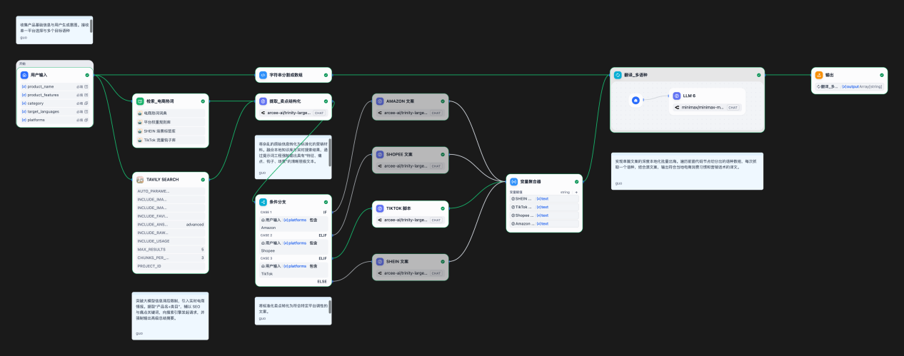
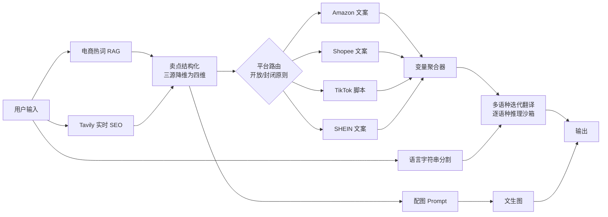

# CopyFlow · 多平台跨境电商内容自动化系统

> 一次输入产品信息，同时产出 **Amazon / Shopee / TikTok / SHEIN** 四平台差异化文案 + **多语种深度本地化**译文 + 商品主图。
> 把跨境卖家的多平台内容生产，从「串行人工撰写 3–7 天」压缩为「并行自动化输出 分钟级」。

<p>
  <a href="https://guo25476688-cmd.github.io/copyflow-crossborder-ecom/"><b>▶ 在线 Demo（演示模式，免配置）</b></a> ·
  <a href="docs/PRD.md">PRD</a> ·
  <a href="docs/prompt-engineering.md">Prompt 工程</a> ·
  <a href="docs/workflow-design.md">工作流设计</a>
</p>



---

## 30 秒了解

| | |
|---|---|
| **是什么** | 一个跑通的 AI 内容生产系统：Dify 工作流（后端逻辑）+ CopyFlow Web 原型（产品界面）+ 完整 PRD |
| **解决什么** | 跨境卖家上一款新品要为 4 个平台写 4 套风格迥异的文案，再翻译成多个东南亚语种并做本地化——每次耗时数天，而流量窗口只有几天 |
| **怎么解决** | 三源数据（本地电商热词 RAG + Tavily 实时 SEO + 原始产品特性）强制降维成结构化卖点 → 平台专属 Prompt 并行生成 → 逐语种沙箱做本地化编辑 |
| **验证到什么程度** | 工作流端到端跑通，四平台 Prompt 产出真实样本；Web 原型实现核心交互并部署上线；北极星指标（文案采纳率 ≥ 60%）与评估体系已定义 |

## 我在这个项目里做了什么

这是一个 AI 产品经理方向的作品项目。我负责：

- **需求与竞品**：跨境卖家访谈 + 6 个竞品拆解，定位「跨平台 + 懂规则 + 能本地化」的市场空白，输出 [PRD](docs/PRD.md)（含北极星指标、用户旅程、MVP 范围与「不做什么」的取舍）
- **工作流设计**：设计十余节点 Dify 工作流的整体架构——三源数据融合、开放/封闭原则的平台路由、迭代节点做多语种本地化（[设计说明](docs/workflow-design.md)）
- **Prompt 工程**：为 4 个平台分别设计 System Prompt，并基于实测做了 4 轮迭代（违禁词、JSON 格式坍塌、脚本结构、翻译丢格式），把 Amazon 违规率从 ~15% 降到接近 0（[Prompt 工程文档](docs/prompt-engineering.md)）
- **产品原型**：把工作流封装成可交互的 [CopyFlow Web 原型](prototype/)，设计输入分流、并行进度、多平台/多语种对比结果页，并部署为在线 Demo

## 演示

**在线体验**（30 秒）：打开 [Demo](https://guo25476688-cmd.github.io/copyflow-crossborder-ecom/) → 点输入区的 `load example` 一键预填 `HoverGo Pro` → 点 `generate` → 看四个平台 Tab 依次点亮，Amazon 下切换 English / Indonesian 对比本地化差异。

> Demo 默认演示模式，数据为预置样例；填入自己的 Dify endpoint + key 即可接真实工作流。

## 三大痛点 → 解法

| 痛点 | 传统做法的问题 | 本系统的解法 |
|---|---|---|
| **多平台调性差异** | 同一套文案「改改格式」应付 4 个平台，各平台转化都不最优 | 每个平台独立 System Prompt，按约束方向区分：Amazon 合规驱动 / Shopee 转化驱动 / TikTok 结构驱动 / SHEIN 调性驱动 |
| **人工撰写滞后于市场** | 交付周期 3–7 天，赶不上热搜词和竞品动态 | Tavily 实时 SEO 搜索注入最新趋势 + 并行生成，分钟级出稿 |
| **本地化流于表面** | 翻译软件直翻，不懂 `gratis ongkir` 对印尼买家意味着什么 | 逐语种「本地化编辑」而非翻译：植入本土高频促销词、保留 Markdown/Emoji、英语只润色不翻译 |

## 系统架构



关键设计决策：

- **三源数据强制融合**：RAG 本地热词 + Tavily 实时 SEO + 原始特性，在一个节点降维成「核心卖点 / 用户痛点 / 视频钩子 / 应用场景」四维结构，平台 Prompt 只消费干净结构
- **LLM 原生检索**：用 Tavily 替代传统 HTTP 搜索，AI 在底层清洗去重，直接返回高密度摘要，避免 token 浪费和上下文溢出
- **迭代节点替代单次多语输出**：为每种语言开独立推理沙箱，防止语言污染、格式坍塌、token 截断
- **平台路由遵循开放/封闭原则**：新增平台只需加一个并行分支 + 一个 Prompt，不改动现有流程

详见 [工作流设计说明](docs/workflow-design.md)。

## Prompt 工程亮点

| 平台 | 约束方向 | 关键设计 |
|---|---|---|
| Amazon | 约束「不能有什么」 | Prompt 末尾「规则检查清单」做生成前自检，违规率 ~15% → ≈0 |
| Shopee | 约束「必须有什么」 | 硬编码 `gratis ongkir` / `Ready Stock` 等本土触发词 |
| TikTok | 约束「按什么顺序」 | 显式时间轴（0–5s 钩子 / 5–15s 痛点 / 15–35s 方案 / 35–50s CTA），逼模型按注意力分配组织内容 |
| SHEIN | 约束「先定调再展开」 | 「风格笔记」前置模块 + 强制感官词汇 |

**迭代记录**（节选）：

| 问题现象 | 根本原因 | 解决方案 |
|---|---|---|
| 五点描述被输出成 JSON 数组 | 模型默认「结构化 = JSON」 | 明确禁用 JSON + Markdown 示例展示期望格式 |
| Amazon 偶发违禁词 | 逐 token 生成，靠前约束对靠后内容衰减 | 末尾加规则检查清单 |
| TikTok 脚本是线性叙事 | 只给角色没给结构 | 加显式时间轴 |
| 多语翻译丢 Emoji / 改分隔符 / 加废话前缀 | 注意力集中在语言转换 | 三条排版硬约束 |

完整内容见 [Prompt 工程设计](docs/prompt-engineering.md)，Prompt 原文见 [`workflow/prompts/`](workflow/prompts/)。

## 产品原型 CopyFlow

[`prototype/index.html`](prototype/index.html) —— 单文件、无构建、无依赖，把工作流封装成产品界面：

- 三种输入模式：结构化表单 / 粘贴商品 URL / 自由文本
- 生成中各平台 Tab 依次「点亮」，让「多平台并行」被看见
- 结果页平台 Tab + 语种 Tab 双层对比，分区块复制
- 演示模式免配置，也可接入真实 Dify API

已实现与未实现的诚实清单见 [prototype/README.md](prototype/README.md) 和 [PRD 4.5](docs/PRD.md#45-原型与-prd-的差异诚实记录)。

## 技术选型与权衡

| 决策 | 选择 | 权衡 |
|---|---|---|
| 工作流引擎 | Dify | 快速验证 Prompt 与架构，产品化后降级为纯推理引擎，业务逻辑收归自有后端 |
| 模型 | OpenRouter 免费模型 | 零成本验证 Prompt 设计；代价是速率受限、稳定性偏低——性能验证留到产品化阶段 |
| 检索 | Tavily（LLM 原生） | 相比 SerpApi 式 HTTP 搜索，省 token、降噪声；替换成本高、收益低，产品化保持不变 |
| 多语输出 | 迭代节点逐语种 | 隔离性换延迟：调用次数 = 语言数 |
| 输入形态 | 文本，放弃语音 | 语音信噪比低、识别错误会在下游连锁放大 |

## 局限与下一步

- 知识库需人工定期更新 → 引入自动化更新（抓取平台卖家文档）
- 平台路由新增需手写 Prompt → 探索元提示（从规则库动态拼装）
- 条件分支单次只路由一个平台 → 改并行节点
- 本地化深度不均（仅印尼/泰/西语有明确指南）→ 扩展语言规则或建本地化知识库
- 原型前端缺历史记录页、主图预览、合规标红可视化

## 仓库导航

```
.
├── README.md                    本文件
├── docs/
│   ├── PRD.md                    产品需求文档（含北极星指标、用户研究、竞品、评估体系、冷启动）
│   ├── workflow-design.md        Dify 工作流架构与节点级设计
│   ├── prompt-engineering.md     Prompt 设计原则、逐平台决策、迭代记录、权衡
│   └── assets/                   工作流画布截图
├── workflow/
│   ├── 多平台跨境电商文案及图片生成.yml   可导入的 Dify DSL
│   ├── README.md                导入方式、知识库依赖、模型说明
│   └── prompts/                  从工作流抽取的各节点 Prompt 原文
└── prototype/
    ├── index.html               CopyFlow Web 原型（单文件）
    └── README.md                运行方式、接入真实 API、已实现清单
```

## 关于这个项目

个人项目，全部内容由 **Stella** 独立完成：需求与竞品分析、PRD、Dify 工作流架构、Prompt 工程与迭代、CopyFlow Web 原型开发与部署。

## License

[MIT](LICENSE)
