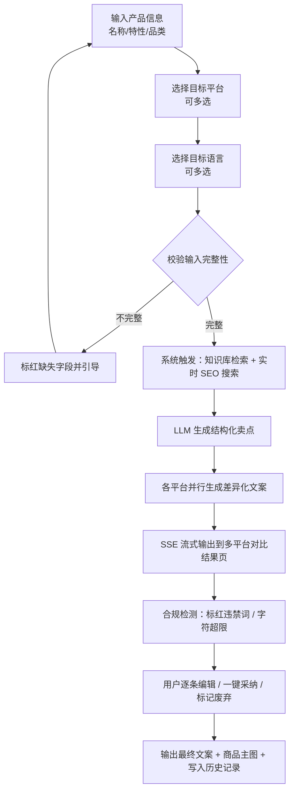

# 多平台跨境电商 AI 文案助手 · PRD

| | |
|---|---|
| 文档版本 | v1.0 |
| 作者 | 郭树奇 |
| 文档状态 | 评审中 |
| 覆盖范围 | MVP（v1.0）——单用户、单品、多平台文案并行生成 |
| 关联文档 | [工作流设计](workflow-design.md) · [Prompt 工程](prompt-engineering.md) · [产品原型](../prototype/) |

---

## 一、文档背景

### 1.1 项目背景

一个在亚马逊、Shopee、TikTok Shop 同时运营的跨境卖家，上架一款新品至少要写 3 套完全不同风格的文案：亚马逊要求关键词密度高、合规措辞严谨；Shopee 需要口语化、Emoji 密集、突出促销；TikTok 需要情绪化的短句钩子和完整口播脚本。若还要覆盖东南亚市场，这套内容还要翻译成印尼语、泰语、马来语并做本地化微调。

对中小卖家而言，每上一款新品光文案就要花数天人力，而市场窗口期往往只有几天。现有 AI 工具要么过于通用，要么只服务单一平台——**跨平台、懂规则、能本地化的垂直 AI 文案工具至今仍是市场空白**。

### 1.2 问题陈述

通过对跨境卖家的访谈与调研，识别出内容生产环节的三个核心痛点：

**痛点一：多平台调性差异导致文案严重不适配**
> "同一款产品，我在亚马逊发的 Listing 风格放到 TikTok 上没人看，放到 Shopee 上点击率也很低。但我哪有时间为每个平台重写一遍？"

亚马逊 Listing 以 SEO 为核心；Shopee 强调性价比感知和促销氛围；TikTok 的核心是情绪钩子和口播节奏。卖家往往用同一套文案「改改格式」应付多个平台，导致各平台转化率均达不到最优。

**痛点二：人工撰写效率低，严重滞后于市场动态**
> "竞品改了标题、蹭上了热搜词，我这边还在等文案策划回稿，黄金流量期就这么过去了。"

跨境电商的流量窗口极短，要求 24–48 小时内完成文案更新，而当前依赖人工/外包的模式平均交付周期 3–7 天。单平台低 SKU 时尚可接受，扩展到多平台运营后人力成本和响应速度都成为瓶颈。

**痛点三：本地化流于表面，深度不足影响转化**
> "我用翻译软件把中文直翻成印尼语，卖家反馈说读起来很奇怪，后来才知道当地人买东西特别在意'包邮'这两个字，但我们的文案里根本没有。"

多数卖家对目标市场的消费习惯缺乏了解，本地化仅停留在语言翻译层面。东南亚市场对 `gratis ongkir`（包邮）极度敏感，泰语文案需要礼貌助词才符合本地阅读习惯——这些细节直接影响点击率和加购率，现有工具几乎不提供。

### 1.3 产品目标

**核心定位**：为跨境电商卖家和独立站运营者提供多平台差异化 AI 文案生成能力，一次输入产品信息即可同时获得符合各平台规则与调性的本地化文案及商品主图，将多平台内容生产从「串行人工撰写（3–7 天）」压缩为「并行自动化输出（3 分钟内）」。

区别于 Jasper、Copy.ai 等通用工具：本产品深度适配 Amazon / Shopee / TikTok Shop / SHEIN 四大平台的内容规则、搜索权重机制和用户消费习惯，内置基于平台规则的 Prompt 体系和电商热词知识库，支持印尼语/泰语/西班牙语/英语等多语种的地道本地化翻译。

**三个层次的目标**：

| 层次 | 解决的问题 | 具体目标 |
|---|---|---|
| 效率 | 「慢」 | 单品多平台文案生产周期从 3–5 天缩短至 5 分钟内，多平台并行输出 |
| 质量 | 「不适配」 | 生成内容符合各平台格式规范与算法偏好，减少因不合规/调性不匹配导致的流量损耗 |
| 本地化 | 「表面化翻译」 | 超越字面翻译，将目标市场高频促销话术、文化偏好、搜索习惯融入生成内容 |

### 1.4 成功指标（北极星指标）

**北极星指标：文案采纳率（Generated Content Adoption Rate）** —— 用户生成文案后选择「直接使用」或「小改后使用」的比例，目标 **≥ 60%**。

选这个指标而非留存或 DAU：产品的核心价值就是「生成的东西能用」——如果用户每次都要大幅修改甚至重写，无论留存多好看都是虚假繁荣。

**用户行为指标**

| 指标 | 目标值 | 备注 |
|---|---|---|
| 首次生成完成率 | ≥ 75% | 低于此值说明引导流程或输入门槛有问题 |
| 7 日留存率 | ≥ 40% | 对标同类 AI 工具行业均值约 35% |
| 30 日留存率 | ≥ 25% | 判断是否形成使用习惯的关键节点 |
| 平均每周使用次数 | ≥ 3 次 | 对应「每周上新 3 款产品」的典型卖家行为 |
| 平均生成平台数 | ≥ 2.5 个 | 低于 2 说明用户没感受到多平台并行的价值 |

**质量指标**

| 指标 | 目标值 | 备注 |
|---|---|---|
| 直接使用率 | ≥ 30% | 未经编辑直接采用，是质量天花板指标 |
| 小改后使用率 | ≥ 30% | 与直接使用率合计 = 北极星指标 60% |
| 废弃率 | ≤ 20% | 超过需立即排查对应平台 Prompt 质量 |
| 重新生成率 | ≤ 15% | 过高说明首次生成质量不达预期 |
| 平台合规通过率 | ≥ 95% | 检测违禁词、字符超限等硬性规则 |

**业务指标（冷启动阶段为假设目标）**

| 指标 | 目标值 | 备注 |
|---|---|---|
| NPS | ≥ +30 | SaaS 工具良好水平 |
| 免费 → 付费转化率 | ≥ 8% | Freemium 模式，行业参考 5%–12% |
| 用户月均生成次数 | ≥ 12 次 | 对应月均上新 3–4 款、每款 3 个平台 |

数据收集：行为指标走产品埋点；质量指标依赖用户主动反馈（每条文案旁 👍👎）+ 自动规则检测；NPS 通过第 3 次使用后的弹窗问卷（≤ 2 问）。冷启动期用户 < 50 人时，以每周 2–3 次种子用户访谈代替量化统计，直接问「上周用了哪条、改了哪里」。

### 1.5 文档范围

**MVP 包含**：产品信息输入与卖点结构化提取、四平台差异化文案并行生成、多语种本地化翻译（英/印尼/泰/西）、商品主图 AI 生成、生成结果查看与编辑、历史记录管理。

**MVP 不包含**（及原因）：

| 不做 | 原因 |
|---|---|
| 团队协作与多账号 | 早期以个人/小团队为主，协作需求在规模扩大后才出现 |
| API 接入与 ERP 集成 | 深度集成需求，适合核心价值验证后作为付费功能 |
| 批量 SKU 生成 | 对工程架构要求高，MVP 优先打磨单品质量而非吞吐 |
| 自定义 Prompt 模板 | 需要完善的权限管理和容错机制，列入 v2.0 |
| 数据分析看板 | 依赖使用数据积累，MVP 阶段数据量不足以支撑有意义的分析 |

**迭代方向**：v2.0 批量生成 + 自定义 Prompt 模板；v2.5 接入主流跨境 ERP（领星、马帮）；v3.0 开放 API + 团队协作。

---

## 二、用户研究

### 2.1 研究方法

以定性访谈为主，辅以竞品用户评论分析。访谈对象为有跨境电商实际运营经验的从业者，覆盖亚马逊卖家、Shopee 卖家、独立站运营三类角色，单次 30–45 分钟。招募渠道：跨境电商微信交流群、闲鱼跨境卖家社区、领英（职位含「跨境运营」/「Amazon Seller」）。

补充研究：抓取 Jasper、Copy.ai、营销星球等竞品在 App Store、G2、Product Hunt 的用户评论，标记差评中反复出现的关键词。

**局限性**：样本量较小，以个人卖家和小团队为主，中大型卖家团队的需求尚未覆盖；结论以定性洞察为主，需在上线后通过埋点数据量化验证。

### 2.2 目标用户画像

**核心用户：跨境独立站运营**
中小跨境企业的内容运营，独自负责 2–3 个品牌独立站的全部内容工作，兼顾 Shopee / TikTok Shop 日常运营。非技术背景，工具接受度高，但上手成本不能太高。

典型的一天：早上刷竞品亚马逊 Listing 和 TikTok 主页记录热词；上午集中写文案（本周 3 款新品 × 独立站首页 / Shopee 详情 / TikTok 脚本）；午后处理买家反馈、更新旧描述。工具链是 ChatGPT 打草稿 + 人工润色 + Excel 管关键词 + Canva 做图，四五个工具来回切换。

最大卡点是**本地化**：产品主要卖东南亚，但不懂印尼语和泰语，只能用翻译软件直翻，自己知道有问题但不知道怎么改。

成功标准：不是文案多漂亮，而是「发出去之后不用再改」——没被平台下架、没有买家反映描述与实物不符、搜索排名稳定。希望一款新品从准备内容到上架控制在半天内。

> "最烦的不是写文案本身，是同一款产品要为不同平台改四五遍，改到后来自己都不知道哪个版本是最新的。"

**次要用户：亚马逊多店铺卖家**
运营 3–5 个店铺，SKU 多、上新频繁，文案需求是批量化的。对 Amazon 平台规则极度敏感（违禁词、关键词堆砌、类目规则都踩过坑，被下架过），对 AI 生成内容的第一反应是「合规性能保证吗」。核心诉求差异：需要批量处理能力、更关注关键词策略而非文案调性、其他平台是次要的。

> "AI 写的我不怕质量差，我怕的是莫名其妙被亚马逊判违规，那损失就大了。"

### 2.3 用户访谈核心洞察

| # | 洞察 | 对产品设计的启发 |
|---|---|---|
| 1 | 真实痛点不是「不会写文案」，而是「同一件事要重复做四五遍」 | 核心价值主张应是「一次输入，多平台同时出结果」，首屏和引导都强化这个价值 |
| 2 | 合规问题是使用 AI 工具的最大心理障碍，尤其亚马逊卖家 | 合规检测必须内置在生成流程里，结果页在文案旁直接显示合规状态、标红违规词 |
| 3 | 本地化是用户最没能力自己解决、也最愿意付费的点 | 多语种本地化是最难被替代的差异化能力，要在产品介绍中重点突出，并让质量「被看见」（如标注「已融入印尼语本土促销话术」） |
| 4 | 用户对 AI 内容的采纳门槛是「八成可用」，不需要完美 | 结果页要方便快速局部编辑，不能只有「全部采纳」或「重新生成」两个极端 |
| 5 | 用户没有建立内容管理习惯，历史文案经常找不到 | 历史记录要支持按产品名/平台/日期检索，允许打标签（「效果好」「已发布」） |

### 2.4 核心需求优先级

| 需求 | 优先级 | 依据 |
|---|---|---|
| 一次输入，四平台文案并行生成 | P0 | 访谈（100% 受访者提及） |
| Amazon Listing 合规自动检测与违禁词标红 | P0 | 访谈 + 竞品分析（现有工具普遍缺失） |
| 多语种深度本地化（印尼/泰/西/英） | P0 | 访谈（最高付费意愿点） |
| 生成结果支持局部编辑而非全量重写 | P0 | 访谈 |
| 商品主图 AI 生成 | P1 | 访谈（有需求但非最痛点） |
| 历史记录管理与检索 | P1 | 访谈（影响作为主力工具的留存） |
| 生成内容质量反馈（👍👎 埋点） | P1 | 支撑 Prompt 迭代闭环 |
| SEO 关键词覆盖率检测 | P1 | 竞品分析 |
| 批量 SKU 生成 | P2 | 访谈（多店铺卖家需求，MVP 不做） |
| 自定义 Prompt 模板 | P2 | v2.0 规划 |
| 与 ERP 系统集成 | P2 | 长期方向 |

### 2.5 用户旅程地图

以核心用户上新一款蓝牙耳机为例：

| 阶段 | 情绪 | 说明 |
|---|---|---|
| 1 发现内容需求 | 中性 | 拿到产品规格表和图，规划要产出的内容（3 平台 + 印尼语版本） |
| 2 收集素材与竞品参考 | 耗神但可接受 | 手动记录竞品标题关键词、刷 TikTok 看脚本风格、查谷歌趋势，约 1–2 小时 |
| 3 开始撰写文案 | **低落，最大痛点区** | ChatGPT 反复调 Prompt，Amazon 版出现违禁词要手动排查；Shopee 版要完全重写；TikTok 脚本风格又不同，写到这里精力耗尽质量下降；印尼语本地化不知从何下手 |
| 4 内部审核与反复修改 | 焦虑 | 改一个版本其他版本要同步，容易遗漏，周期 2–3 天 |
| 5 上架发布 | 如释重负但不确定 | 逐平台复制粘贴，不确定文案效果，尤其印尼语版本没底 |
| 6 数据复盘 | 被动、缺乏抓手 | 一两周后看数据，想优化但原草稿找不到，只能重写，进入下一循环 |

---

## 三、竞品分析

### 3.1 竞品概览

选取六个竞品，覆盖四类：国外通用 AI 写作（Jasper、Copy.ai）、国内 AI 写作（营销星球、通义写作助手）、平台自带 AI（Amazon 卖家后台 AI）、自有 Dify 工作流基线。

### 3.2 对比

| 维度 | Jasper | Copy.ai | 营销星球 | 通义写作助手 | Amazon 后台 AI | 自有 Dify 工作流 |
|---|---|---|---|---|---|---|
| 产品定位 | 企业级 AI 内容创作平台 | AI 营销文案自动化 | 国内电商营销内容生成 | 通用 AI 写作助手 | Amazon 单平台 Listing 优化 | 跨境多平台文案+图片生成原型 |
| 支持平台 | 通用，无平台专属 | 通用，无平台专属 | 淘宝/拼多多/抖音 | 通用 | 仅 Amazon | Amazon/Shopee/TikTok/SHEIN |
| 本地化能力 | 多语言生成，无电商本土化 | 多语言，无本土促销话术 | 仅中文 | 支持翻译，无本土化 | 仅英语 | 印尼/泰/西语 + 本土促销话术 |
| Prompt 可定制 | 品牌语调设置，模板固定 | 工作流可自定义，门槛高 | 不可定制 | 不可定制 | 不可定制 | 平台专属 Prompt，完全可定制 |
| 定价 | $49/月起 | $36/月起 | ¥99/月起 | 免费+会员 | 免费（含账号） | 自建，API 成本极低 |
| 最大缺陷 | 不懂平台规则，无合规检测 | 通用性强但垂直化不足 | 不支持跨境平台和多语种 | 无电商场景适配 | 只能用于 Amazon，无法跨平台 | 无产品界面，需懂 Dify |

### 3.3 机会点

现有产品普遍缺乏对跨境电商平台规则的深度适配和多平台并行输出能力，卖家要么在多个通用工具间反复切换、要么在 AI 结果上花大量时间人工改造。本产品的核心机会：以**平台专属 Prompt 体系 + 电商热词知识库 + 实时 SEO 搜索**为技术基础（已在 Dify 工作流中完整验证），构建第一个真正懂跨境平台规则、能一键输出多平台差异化内容并支持东南亚深度本地化的垂直 AI 文案工具。

---

## 四、产品方案

### 4.1 产品定位

面向跨境电商卖家和独立站运营者的垂直 AI 文案工具，通过**平台专属 Prompt 体系、电商热词知识库与实时 SEO 双轨输入**，帮助用户一次输入产品信息即可同时获得 Amazon / Shopee / TikTok / SHEIN 四平台合规、差异化、可直接发布的本地化文案与商品主图。

### 4.2 MVP 功能范围

| 功能 | 优先级 | 说明 | MVP |
|---|---|---|---|
| 产品信息输入 | P0 | 产品名称、特性描述、品类、目标平台、目标语言 | ✅ |
| 卖点结构化提取 | P0 | LLM 结合知识库热词 + Tavily 实时 SEO 提取核心卖点/痛点/场景 | ✅ |
| 四平台文案并行生成 | P0 | 各自独立 Prompt，风格差异化 | ✅ |
| Amazon 合规自动检测 | P0 | 扫描违禁词、字符超限，标红并给修改建议 | ✅ |
| 多语种深度本地化 | P0 | 英/印尼/泰/西，融入本土促销话术 | ✅ |
| 生成结果查看与局部编辑 | P0 | 分 Tab 展示，结果页直接编辑，不强制重新生成 | ✅ |
| 商品主图 AI 生成 | P1 | 白底、打光均匀、突出卖点 | ✅ |
| 历史记录管理 | P1 | 按产品名/平台/日期检索，打标签，复用 | ✅ |
| 质量反馈埋点 | P1 | 每条文案旁 👍👎，收集采纳/废弃行为 | ✅ |
| 批量 SKU 生成 | P2 | — | ❌ 后续版本 |
| 自定义 Prompt 模板 | P2 | — | ❌ 后续版本 |
| 团队协作与多账号 | P2 | — | ❌ 后续版本 |
| 数据分析看板 | P2 | — | ❌ 后续版本 |
| API 接入与 ERP 集成 | P3 | — | ❌ 后续版本 |
| 图片上传识别卖点 | P2 | — | ❌ 后续版本 |

### 4.3 核心用户流程

**主流程：多平台文案生成**



**辅助流程：多语种本地化**
用户在输入页添加目标语言 → 主流程生成的平台文案进入迭代节点 → 每个语种独立翻译 + 本地化微调（保留 Markdown/Emoji）→ 结果页每个平台 Tab 下按语种再分 Tab 展示，并标注「已融入 XX 本土促销话术」。

**异常流程**

| 场景 | 处理 |
|---|---|
| 用户输入不完整 | 生成按钮置灰，缺失字段标红提示，不发起请求 |
| 单个平台生成失败 | 该平台 Tab 标记失败态，其他平台正常展示，提供「单独重试该平台」 |
| 网络超时（> 60s） | 展示超时提示 + 重试按钮，已到达的部分结果保留 |
| 合规检测发现高风险违禁词 | 结果顶部黄条警告，违禁词标红，提示「建议人工确认后再发布」 |
| 特定敏感品类（食品/医疗） | 生成前提示「该品类平台规则特殊，生成结果仅供参考」 |
| 免费额度耗尽 | 引导至升级页，历史记录仍可查看 |

### 4.4 关键页面设计

> MVP 原型已实现，见 [`../prototype/`](../prototype/)（在线 Demo 为演示模式）。

| 页面 | 核心设计决策 |
|---|---|
| **1 · 产品信息输入页** | 三种输入模式降低填写负担：结构化表单 / 粘贴商品 URL / 自由文本；提供「载入示例产品」一键预填，让用户不填也能先看到效果（Aha moment）；平台多选、语言以 tag 形式自由增删 |
| **2 · 生成中（Loading）** | 不用单一进度条——各平台以骨架屏 + Tab 依次「点亮」，让用户看到并行进度；SSE 流式让文案逐段出现而非等待一次性加载，降低等待焦虑 |
| **3 · 多平台文案对比结果页**（核心） | 平台 Tab 横向切换，每个平台下按「标题 / 五点描述 / 产品描述」等区块分段；每段独立「复制」按钮；多语种时平台 Tab 下再分语种 Tab；违规词标红 + 侧栏合规状态 |
| **4 · 文案编辑与确认** | 结果页区块内联编辑，实时保存；提供「复制本段 / 复制全部 / 单独重新生成本段」 |
| **5 · 历史记录页** | 按产品名搜索、按平台筛选、按日期排序；支持打标签（效果好/已发布）与一键复用为新的生成输入 |
| **6 · 商品主图预览页** | 展示 AI 生成主图，支持「重新生成 / 下载」 |

### 4.5 原型与 PRD 的差异（诚实记录）

当前原型（CopyFlow）实现了页面 1–4 的核心交互，**页面 5（历史记录）、页面 6（主图预览 UI）、合规检测的可视化标红尚未在前端实现**；商品主图生成、合规检测在 Dify 工作流层面已跑通，未接入原型 UI。

---

## 五、Prompt 工程设计

> 完整内容见 [Prompt 工程设计文档](prompt-engineering.md)，Prompt 原文见 [`../workflow/prompts/`](../workflow/prompts/)。以下为要点。

### 5.1 设计原则

1. **每个平台独立 System Prompt**：四平台内容逻辑存在根本差异，通用 Prompt + 参数切换会让模型同时兼顾互相冲突的约束，四个平台都不到位。
2. **以约束方向区分平台**：Amazon 合规驱动（约束「不能有什么」）、Shopee 转化驱动（「必须有什么」）、TikTok 结构驱动（「按什么顺序」）、SHEIN 调性驱动（「先定调再展开」）。
3. **Context 注入集中化**：RAG 热词 + Tavily SEO + 原始特性在「卖点结构化」节点汇聚降维，平台 Prompt 只消费干净的四维结构。
4. **temperature 统一 0.7**：结构化约束由 Prompt 结构承担，不靠低温压制发散。

### 5.2 各平台 Prompt 设计详解

见 [Prompt 工程设计文档 · 第 2 节](prompt-engineering.md#2-逐平台设计决策)。

### 5.3 本地化翻译 Prompt

见 [Prompt 工程设计文档 · 逐平台设计决策 · 本地化翻译](prompt-engineering.md#本地化翻译)。核心：定位为「本地化编辑」而非「翻译工具」，三条硬约束保证 Markdown / Emoji / 分隔符不被破坏。

### 5.4 Prompt 迭代记录

| # | 问题现象 | 根本原因 | 解决方案 | 效果 |
|---|---|---|---|---|
| 1 | 五点描述被输出成 JSON 数组 | 模型默认「结构化 = JSON」 | 明确「切勿使用 JSON」+ Markdown 示例展示期望格式 | 问题基本消除 |
| 2 | Amazon 偶发违禁词（~15%） | 逐 token 生成，靠前约束对靠后内容衰减 | Prompt 末尾加「规则检查清单」做生成前自检 | 违规率降至接近 0 |
| 3 | TikTok 脚本是线性叙事，不符合平台节奏 | 只给角色和风格，没给结构 | 加入显式时间轴（0–5s/5–15s/15–35s/35–50s） | 结构命中率显著提升 |
| 4 | 多语翻译丢 Emoji、改分隔符、加废话前缀 | 注意力集中在语言转换 | 三条硬约束 + 保留 ｜【】 | 排版稳定，解析不再被污染 |

---

## 六、AI 效果评估体系

### 6.1 生成质量评估维度

| 维度 | 评估方式 | 自动化程度 |
|---|---|---|
| 平台合规性 | 违禁词黑名单、字符数上限、格式规则 | 规则引擎全自动 |
| 关键词覆盖率 | 核心 SEO 词是否出现在标题/描述 | 程序化检测 |
| 调性匹配度 | 让另一个 LLM 按平台调性 rubric 打分（0–5），低分抽样人工复核 | 半自动 |
| 结构完整性 | 是否包含该平台要求的全部区块（如 Amazon 必须 5 条 bullet） | 程序化检测 |
| 用户采纳结果 | 直接用 / 小改 / 大改 / 废弃四态埋点 | 依赖用户行为 |

### 6.2 用户满意度收集机制

- **结果页**：每条文案旁 👍👎（轻量，不打断）
- **编辑完成后**：可选一次性 1–5 星评分，不强制
- **发布后**（若能拿到）：文案使用后的平台转化数据回流

原则：不设计过重的反馈流程，用户不会填问卷。

### 6.3 Fallback 策略

| 触发条件 | 降级动作 |
|---|---|
| 合规检测命中高风险违禁词 | 顶部警告 + 标红 + 「建议人工确认」，不阻断但强提示 |
| 用户连续 3 次点「重新生成」同一平台 | 弹出提示，引导补充产品信息或切换到人工编辑 |
| 敏感品类（食品/医疗/保健） | 生成前免责提示，合规阈值收紧 |
| LLM 自评分低于阈值（如 < 3/5） | 自动重试一次；仍低分则标记「质量待确认」并记录用于 Prompt 分析 |
| 模型 API 超时/报错 | 降级到备用模型；仍失败则返回明确错误 + 保留已生成部分 |

### 6.4 评估闭环设计

```
用户反馈(👎/废弃/低分) → 每周汇总低分样本 → 人工分析原因 → 定位到具体平台 Prompt 的哪一段
  → 修改 Prompt → 用固定测试集（10 款不同品类产品）跑 A/B → 对比合规率/结构命中率/调性评分 → 上线
```

周期：每周一次；执行人：产品 + 提示词工程师各 1。

---

## 七、冷启动策略

### 7.1 种子用户获取

第一批 10–20 个用户来源：

1. **前期访谈用户直接转化**——已建立信任，痛点已确认，转化成本最低
2. **跨境电商微信群 / 闲鱼卖家社区**——发布带演示 GIF 的招募，定向邀请活跃卖家
3. **Dify 社区 / AI 工具分享社群**——这批人对工作流原型接受度高，能给专业反馈

### 7.2 首次体验设计（Aha Moment）

Aha moment：**「填了一次产品信息，30 秒内看到四个平台风格完全不同的文案，而且亚马逊那条直接能用。」**

设计手段：
- 输入页提供「载入示例产品（HoverGo Pro）」按钮，一键预填 → 用户不用自己想产品就能看到完整效果
- 生成中各平台 Tab 依次点亮，让「多平台并行」这件事**被看见**
- 结果页对印尼语版本标注「已融入印尼语本土促销话术（gratis ongkir 等）」，让本地化价值可感知

### 7.3 从 0 到第一批活跃用户的路径

| 阶段 | 核心任务 | 进入下一阶段的条件 |
|---|---|---|
| 0 → 10 | 私域一对一邀请 + 陪跑，收集每次生成的采纳/修改细节 | ≥ 6 人完成 ≥ 3 次真实生成，北极星指标 ≥ 50% |
| 10 → 50 | 按反馈迭代 Prompt，扩大跨境圈子口碑分享 | 7 日留存 ≥ 35%，出现自发推荐 |
| 50 → N | 考虑公开上线，增加分发渠道（工具目录、内容营销） | 北极星 ≥ 60%，付费转化跑通 |

### 7.4 早期用户激励

- 免费使用权（种子期不设额度上限）
- 优先体验新平台/新语种
- 反馈被采纳时同步告知「你提的问题已在 vX 修复」——让用户感到参与产品

不过度依赖物质激励，最好的激励是产品本身有用。

---

## 八、技术可行性验证

### 8.1 现有原型工作流

Dify 工作流（[`../workflow/`](../workflow/)）已验证的技术假设：

- ✅ 四平台差异化 Prompt 设计已完成并产出实际内容样本
- ✅ 知识库 + Tavily 实时搜索的双轨输入架构已跑通
- ✅ 多语种本地化翻译迭代可行（逐语种沙箱）
- ✅ Pollinations AI 图文一体化输出已实现

### 8.2 现有工作流的技术局限性与产品化方案

| 局限 | 产品化方案 |
|---|---|
| 条件分支单次只能路由到一个平台 | 改为并行节点，多平台同时执行 |
| 输入依赖结构化文本字段 | 支持图片上传 + 旧链接解析 + 智能提取 |
| 无用户界面，需懂 Dify | 标准 Web 界面封装 |
| 无历史记录管理 | 用户账号体系 + 历史记录存储 |

### 8.3 技术架构概述（产品化方向）

四层架构，各层通过 API 通信，便于单独迭代替换。

**前端交互层**：React / Next.js。核心交互是多 Tab 并排展示、内联编辑、实时生成进度。生成过程通过 SSE 流式输出。前端不直接调用任何 AI 接口，所有请求经后端中转，避免 API Key 暴露。

**后端服务层**：Python（FastAPI）或 Node.js。三类职责——① 请求路由：拆解为多平台并行生成任务；② 业务逻辑：账号、历史记录、质量反馈、合规词检测；③ 工作流编排：现阶段复用 Dify 作为工作流引擎，后端作为中间层处理参数与结果解析。MVP 阶段优先开发效率而非性能。

**AI 推理层**（决策最重要的一层）：原型用 OpenRouter 免费模型验证 Prompt 与架构；产品化阶段做正式模型选型（生成质量 / 响应速度 / 成本三角）。知识库检索 + Tavily 架构保持不变——替换成本高、收益低。

**数据存储层**：PostgreSQL 存用户账号、生成任务记录、历史文案、反馈标签；向量数据库（Pinecone / Weaviate）存知识库；商品主图存对象存储（S3 / OSS），库里只存 URL。

**架构演进节奏**：
1. 第一步：以 Dify 为核心，前端直连 Dify API，跳过独立后端，快速验证基本接受度
2. 第二步：用户量和反馈积累后，独立开发后端，将 Dify 降级为纯推理引擎，业务逻辑/数据/用户体系收归自有后端

---

## 九、用户验证与迭代记录

### 9.1 验证方式

把原型链接发给 2–3 个真实卖家，问三个问题：① 这个东西你会用吗？为什么？② 哪里感觉不对？③ 对你最有用的是哪一块？

### 9.2 验证结果摘要

> _待补充：此处记录用户原话。_

### 9.3 基于验证的迭代

> _待补充：记录「改前 → 改后 → 改的理由」。_

当前已基于早期自测完成的迭代：见第五章 Prompt 迭代记录（4 条）。

---

## 十、附录

- **附录 A · 核心 Prompt 原文**：[`../workflow/prompts/`](../workflow/prompts/)
- **附录 B · 工作流架构截图**：[`assets/dify-workflow-canvas.png`](assets/dify-workflow-canvas.png)，节点讲解见 [工作流设计说明](workflow-design.md)
- **附录 C · 用户访谈提纲**：三模块——内容生产流程 / 最痛环节 / 工具使用现状（详见 2.1）
- **附录 D · 竞品对比**：见第三章

---

## 待办 / 已知缺口

- [ ] 9.2 / 9.3 用户验证结果与迭代记录待补充真实访谈数据
- [ ] 原型前端补齐历史记录页、主图预览页、合规标红可视化
- [ ] 工作流条件分支改并行执行
- [ ] 产品化阶段正式模型选型（含成本测算）
