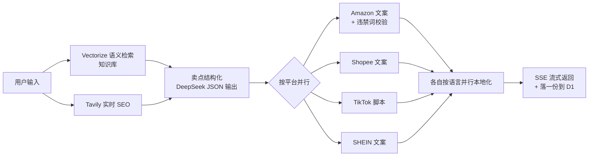

# 系统架构说明

> 本文描述当前实现——[`../worker/`](../worker/)（Cloudflare Worker + DeepSeek + Vectorize + D1）。最早的设计是在 Dify 里可视化搭出来验证的，节点级别的历史记录已经不再维护；这里直接讲现在真正跑的架构。
> 面向产品化的规划见 [`PRD.md`](PRD.md)。

## 1. 一句话描述

用户输入产品信息 → 并行拉取**知识库语义检索**与**实时全网 SEO 数据** → 强制降维成结构化卖点 → 按平台并行生成结构化文案 → 按语言并行本地化翻译 → 通过 SSE 流式返回，哪个平台先好先展示。

把「串行人工撰写（3–7 天）」压缩为「并行自动化输出（分钟级）」。

## 2. 请求处理流程

对应 [`../worker/src/index.js`](../worker/src/index.js) 的 `handleGenerateSSE()`：

**关键设计决策**：

- **三源数据强制融合**：知识库检索 + Tavily 实时 SEO + 原始产品特性，在"卖点结构化"这一步降维成「核心卖点 / 用户痛点 / 视频钩子 / 应用场景」四维 JSON，下游所有平台 Prompt 只消费这个干净的结构，不用各自处理原始输入
- **结构化输出替代 Markdown 正则解析**：DeepSeek 的 `response_format: json_object` 直接产出 JSON，不再靠 Prompt 说服模型"请不要用 JSON"、前端再用正则切 `### 标题`——这条路径以前反复踩过格式坍塌的坑（见 [Prompt 工程设计](prompt-engineering.md)），现在用工程手段根治
- **按平台/语言并行 + SSE 流式**：`Promise.all` 让选中的平台同时生成，每个平台的全部语言也并行翻译；哪个平台先跑完就立刻通过 SSE 推给前端，不用等最慢的那个
- **违禁词校验用真代码兜底**：Amazon 分支生成后跑一次正则检查（`generateAmazonCopy()`），查到违禁词就带着词表明确要求模型重新生成一次，而不是只在 Prompt 里写"请自查"就指望模型遵守
- **知识库用语义检索而不是关键词精确匹配**：Cloudflare Vectorize 存向量、Workers AI 的 `bge-m3` 模型生成 embedding，按产品信息做语义查询，比"知识库 key 精确匹配"更能召回相关但措辞不同的内容
- **落库到 D1**：每次生成结果落一份到 D1，补上原型一直没做的"历史记录"数据层

## 3. 各步骤详解

### 3.1 知识库检索（`queryKnowledge`）

用产品名称+特性做查询文本，生成 embedding 后在 Vectorize 里做向量检索，按 `metadata.type`（`keywords`/`rules`）和 `metadata.platform` 过滤出最相关的几段。知识库内容由 `scheduled()` 定时抓取填充，见 [`../worker/README.md`](../worker/README.md#知识库自动更新)。

> Amazon、Shopee、TikTok 分支会查平台规则；SHEIN 分支不查（`useContext: false`）——它的生成需求已由平台专属 System Prompt 充分覆盖，接入规则库反而会稀释调性。

### 3.2 Tavily 实时搜索（`tavilySearch`）

解决通用 LLM 因训练数据截断导致的信息滞后：

- **查询构建**：`{productName} e-commerce SEO trends, best selling features and consumer pain points`——严格锚定 SEO 趋势与用户痛点
- **搜索深度**：`advanced`，`include_answer: advanced`——Tavily 在底层完成数据清洗，直接返回高密度摘要，降低下游模型的上下文压力

### 3.3 卖点结构化（`buildStructurePrompt`）

同时接收知识库检索结果+实时 SEO+原始产品特性，通过 Prompt 强制降维为四个标准化维度：

| 维度 | 定义 |
|---|---|
| 核心卖点 Features | 最能吸引消费者的产品特性 |
| 用户痛点 Pain Points | 现有产品的缺陷或未满足需求 |
| 视频钩子 Hook Ideas | 专为短视频平台设计的开场标语 |
| 应用场景 Scenarios | 支持生活方式导向叙事的使用场景 |

角色设定为「高级跨境电商产品分析师」，确保输出基于业务逻辑而非文学表达。Prompt 见 [`../worker/prompts/01-卖点结构化.md`](../worker/prompts/01-卖点结构化.md)。

### 3.4 按平台并行生成（`PLATFORM_PROMPTS`）

每个平台独立的 System Prompt，按约束方向区分：

| 平台 | 约束方向 | 关键要求 |
|---|---|---|
| Amazon | 合规驱动（约束「不能有什么」） | 标题+五点描述+产品描述，标题 80–200 字符，禁用 sale/discount 等违规词 |
| Shopee | 转化驱动（约束「必须有什么」） | 长尾词填满 120 字符、Emoji、现货/包邮等本土促销标签 |
| TikTok | 完播率驱动 | 口播脚本 + 时间轴结构（0–5s 钩子 / 5–15s 痛点 / 15–35s 方案 / 35–50s CTA） |
| SHEIN | 生活方式驱动 | 风格笔记模块、感官词汇、灵感/自信/潮流的调性 |

**开放/封闭原则**：新增平台只需在 `PLATFORM_PROMPTS` 加一个条目 + 一份 Prompt，`Promise.all` 会自动把它纳入并行生成，不影响现有平台。

### 3.5 逐语言本地化（`buildLocalizationPrompt`）

以平台文案的 JSON 为源，接收目标语言，做**深度本地化编辑**（保留 JSON 结构、忠于原意、纯 JSON 直出）。各语言特殊处理：印尼语植入 `gratis ongkir` / `diskon besar`；泰语加礼貌助词；西班牙语默认拉美西语；英语只润色不翻译。

## 4. 技术亮点

| 亮点 | 说明 |
|---|---|
| **结构化输出替代 Markdown 正则** | DeepSeek JSON 模式直接产出结构化数据，不用前端正则解析、不会格式坍塌 |
| **SSE 流式返回** | 按平台推送结果，不用等最慢的平台跑完 |
| **语义检索替代关键词精确匹配** | Vectorize + Workers AI embedding，知识库召回不依赖措辞完全一致 |
| **真代码校验替代纯 Prompt 自检** | Amazon 违禁词用正则真检查，查到就带着证据要求模型重新生成 |
| **平台路由遵循开放/封闭原则** | 新增平台只需加一个 Prompt 条目，不改动现有并行逻辑 |

## 5. 功能权衡

- **为何用结构化 JSON 而不是继续用 Markdown**：Markdown 依赖模型"听话"地按格式输出，前端再用正则兜底解析，历史上反复出现格式坍塌（见 [Prompt 工程设计](prompt-engineering.md)）；JSON 模式把这个不确定性交给 API 层解决，代价是 DeepSeek 的 JSON 模式是"尽力而为"不保证严格符合 schema，仍需要防御性解析（`extractJson`）。
- **为何用 Vectorize 而不是继续用纯文本 KV 匹配**：知识库内容规模不大，纯文本匹配够用但召回率依赖措辞一致；语义检索能召回相关但措辞不同的内容，代价是多了 embedding 调用的延迟和成本。
- **为何放弃语音输入**：语音信噪比低、结构缺失，识别错误会在下游搜索与分析中连锁放大。改用文本输入，从源头获取高密度、结构化数据。

## 6. 局限与未来工作

| 局限 | 方向 |
|---|---|
| 知识库定时抓取的目标 URL 还是占位（`KB_SOURCES` 为空） | 需要调研并填入各平台真实的规则页面 |
| 路由仅支持 4 个固定平台，新增需手写 Prompt | 探索元提示（meta-prompt）：从结构化规则库动态提取平台规则拼进统一 Prompt |
| 不同语言本地化深度不均（仅印尼/泰/西语有明确指南） | 扩展语言规则覆盖，或建专门的本地化知识库 |
| D1 只存了数据，没有对应的历史记录页面 UI | 在 `prototype/` 补一个读取 `/api/history` 的列表页 |
| Amazon 违禁词校验只是关键词表 + 一次重试，覆盖面有限 | 扩充词表或换更完整的规则引擎 |
| 无用户账号体系 | 见 [PRD](PRD.md) 里的产品化规划 |
