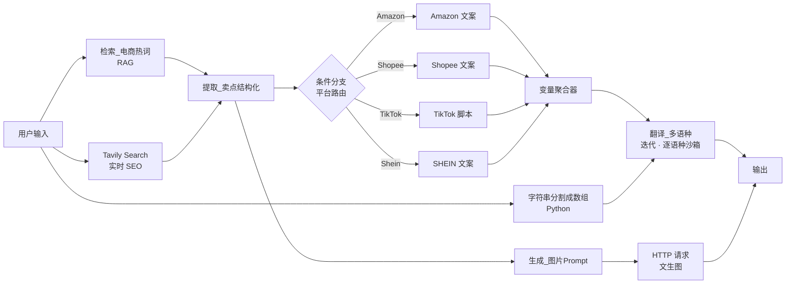

# 工作流设计说明

> 本文是 Dify 工作流的架构与节点级设计文档，对应
> [`../workflow/多平台跨境电商文案及图片生成.yml`](../workflow/多平台跨境电商文案及图片生成.yml)。
> 面向产品化的规划见 [`PRD.md`](PRD.md)。

## 1. 一句话描述

用户输入产品信息 → 系统并行拉取**本地知识库热词**与**实时全网 SEO 数据** → 强制降维成结构化卖点 → 路由到平台专属文案分支 → 逐语种迭代本地化翻译 → 输出多平台、多语言成品文案与商品主图。

把「串行人工撰写（3–7 天）」压缩为「并行自动化输出（分钟级）」。

## 2. 项目背景：传统文案生产的三大痛点

| # | 痛点 | 说明 |
|---|---|---|
| 1 | **过度依赖跨语言迁移，平台适应性不足** | 传统商业翻译局限于字面翻译，忽视不同电商平台在格式规范和语气表达上的差异 |
| 2 | **严重的信息滞后** | 纯文本翻译流程是静态的，无法动态整合实时 SEO 趋势、长尾关键词变化、海外市场消费者热点 |
| 3 | **本地化深度不足** | 机器翻译常产生僵化表达、英式英语混杂或直译结果，难以契合目标市场的营销语境与推广术语 |

## 3. 架构总览

## 4. 节点详解

### 节点 1 · 用户输入

收集系统执行所需的基本变量：

| 字段 | 类型 | 说明 |
|---|---|---|
| `product_name` | 文本 | 核心产品名（如 `HoverGo Pro`），是 Tavily 搜索中提取 SEO 关键词的核心实体 |
| `product_features` | 文本 | 原始规格/描述（如「249 克、三轴稳定」）。既传给下游 LLM，也直接作为节点 2 的检索查询向量 |
| `category` | 选择 | electronics / clothing / home / beauty / sports / food，用于缩小 Tavily 搜索范围 |
| `target_languages` | 文本 | 目标语言字符串（如「英语、泰语、日语」） |
| `platforms` | 选择 | Amazon / Shopee / TikTok / Shein，传给节点 5 决定激活哪个分支 |

### 节点 2 · 检索_电商热词（RAG）

整合 4 个本地知识库，弥补通用 LLM 在垂直营销词汇上的缺失：

- **电商关键词库**：通用关键词、加权转化优先级、术语表、类别-关键词映射
- **平台规则参考库**：各平台格式规范、语气要求、禁止内容、类别内容优先级
- **抖音挂钩库**：按类型和产品类别组织的挂钩模板
- **SHEIN 场景标签库**：生活方式场景与风格描述符

> Amazon、Shopee 分支不使用专用知识库——它们的生成需求已由平台专属 System Prompt 充分覆盖。

配置：`top_k = 7`，多路召回，未启用 rerank。

### 节点 3 · Tavily Search（实时搜索）

解决通用 LLM 因训练数据截断导致的信息滞后。

- **查询构建**：`{product_name} e-commerce SEO trends, best selling features and consumer pain points`——严格锚定 SEO 趋势与用户痛点，让搜索引擎优先返回行业报告、竞品评价、买家反馈，而非购买链接
- **搜索深度**：`advanced`，深入全文并跨源提取
- **返回形态**：`include_answer=advanced`——Tavily 在底层完成数据清洗，直接返回高密度摘要，降低下游模型的上下文压力

### 节点 4 · 提取_卖点结构化（核心节点）

同时接收三路并行输入（本地热词 + 实时 SEO + 原始产品特性），通过 Prompt 强制降维为四个标准化维度：

| 维度 | 定义 |
|---|---|
| 核心卖点 Features | 最能吸引消费者的产品特性 |
| 用户痛点 Pain Points | 现有产品的缺陷或未满足需求 |
| 视频钩子 Hook Ideas | 专为短视频平台设计的开场标语 |
| 应用场景 Scenarios | 支持生活方式导向叙事的使用场景 |

角色设定为「高级跨境电商产品分析师」，确保输出基于业务逻辑而非文学表达。Prompt 见 [`../workflow/prompts/01-卖点结构化.md`](../workflow/prompts/01-卖点结构化.md)。

### 节点 5 · 条件分支（多平台路由）

`if-else` 节点直接读取 `用户输入.platforms`，用互斥条件激活对应平台分支。每个分支配备针对目标平台特性定制的 System Prompt：

| 平台 | 约束方向 | 关键要求 |
|---|---|---|
| Amazon | 合规驱动（约束「不能有什么」） | Markdown 五点描述、标题 80–200 字符、禁用 sale/discount 等违规词 |
| Shopee | 转化驱动（约束「必须有什么」） | 长尾词填满 120 字符、Emoji、现货/包邮等本土促销标签 |
| TikTok | 完播率驱动 | 口播脚本 + 时间轴结构（0–5s 钩子 / 5–15s 痛点 / 15–35s 方案 / 35–50s CTA） |
| SHEIN | 生活方式驱动 | 风格笔记模块、感官词汇、灵感/自信/潮流的调性 |

**开放/封闭原则**：新增平台只需增加并行条件分支 + 一个平台 Prompt，不影响现有流程。

### 节点 6 · 变量聚合器

监控所有平台分支的可能输出，将成功生成的内容合并为单一变量。下游节点无需判断具体走了哪个分支，显著降低数据耦合。

### 节点 7 · 翻译_多语种（迭代节点）

1. **Python 代码节点**：用正则按 `,，;；、` 分割用户输入的语言字符串，清洗成标准数组 `[String]`
2. **迭代节点**：遍历数组，LLM 运行次数 = 语言数
3. **内部翻译 LLM**：以节点 6 的平台文案为源文本，接收当前单一目标语言，做**深度本地化编辑**（保留 Markdown 层级与 Emoji、忠于原意、纯文本直出）

各语言特殊处理：印尼语植入 `gratis ongkir` / `diskon besar` / `stok tersedia`；西班牙语默认拉美西语（`envío gratis` / `ofertas`）；英语只润色不翻译。

### 配图分支 · 生成_图片Prompt → HTTP 请求

文本模型充当「电商商品摄影导演」，产出英文绘图 Prompt → `GET https://image.pollinations.ai/prompt/{prompt}`（`model:flux`，1024×1024）返回商品主图 URL。

## 5. 技术亮点

| 亮点 | 说明 |
|---|---|
| **LLM 原生检索替代传统 HTTP 搜索** | 用 Tavily 替代 SerpApi 式请求，AI 在底层完成网页清洗去重，直接输出高密度纯文本，避免 token 浪费与上下文溢出 |
| **三源数据强制融合** | 原始产品特征 + RAG 本地热词 + Tavily 实时 SEO → 基于 Prompt 的降维 → 标准化四维结构 |
| **基于开放/封闭原则的平台路由** | If/Else + 平台专属 Prompt，新增平台零回归成本 |
| **迭代方法替代单一大模型多语输出** | 每种语言独立推理沙箱：物理隔离防语言污染、无限扩展避免 token 截断、直接输出结构化数组 |

## 6. 功能权衡

- **为何放弃语音输入**：语音信噪比低、结构缺失，识别错误会在下游搜索与分析中连锁放大。改用文本输入，从源头获取高密度、结构化数据。
- **为何用 LLM 原生检索替代传统 HTTP 搜索**：HTTP 搜索返回大量未处理数据，造成噪声、解析困难、上下文溢出，削弱模型注意力。Tavily 等工具返回清洗后的高密度文本，让模型专注语义分析。

## 7. 局限与未来工作

| 局限 | 产品化方向 |
|---|---|
| 知识库需人工定期更新，过时条目降低检索相关性 | 引入自动化更新机制（定期重新收录行业术语、抓取平台卖家文档） |
| 路由仅支持 4 个固定平台，新增需手写 Prompt + 改 if-else | 探索元提示（meta-prompt）：从结构化规则库动态提取平台规则拼进统一 Prompt |
| 不同语言本地化深度不均（仅印尼/泰/西语有明确指南） | 扩展语言规则覆盖，或建专门的本地化知识库 |
| 条件分支单次只路由一个平台 | 改为并行节点，多平台同时执行 |
| 输入依赖结构化文本字段 | 支持图片上传 + 旧链接解析 + 智能提取 |
| 无用户界面，需懂 Dify 才能用 | 标准 Web 界面封装（见 [`../prototype/`](../prototype/)） |
| 无历史记录管理 | 用户账号体系 + 历史记录存储 |
