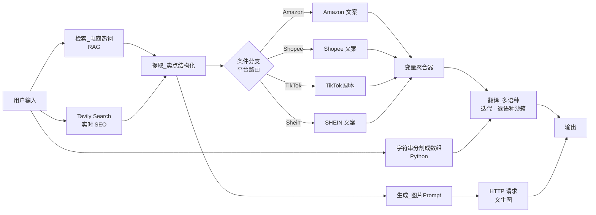

# 工作流设计说明（历史记录：Dify 原型阶段）

> **现状**：产品化阶段已改用 [`../worker/`](../worker/)（Cloudflare Worker + DeepSeek）作为生成后端，本文档描述的 Dify 节点设计不再是当前实现，保留作原型验证阶段「为什么这样设计」的历史记录——节点逻辑已原样移植进 `worker/src/index.js`。
>
> 本文对应 [`../workflow/多平台跨境电商文案及图片生成.yml`](../workflow/多平台跨境电商文案及图片生成.yml)（同样已归档）。面向产品化的规划见 [`PRD.md`](PRD.md)。

## 1. 一句话描述

用户输入产品信息 → 系统并行拉取**本地知识库热词**与**实时全网 SEO 数据** → 强制降维成结构化卖点 → 路由到平台专属文案分支 → 逐语种迭代本地化翻译 → 输出多平台、多语言成品文案与商品主图。

把「串行人工撰写（3–7 天）」压缩为「并行自动化输出（分钟级）」。

## 2. 项目背景：传统文案生产的三大痛点

| # | 痛点 | 说明 |
|---|---|---|
| 1 | **过度依赖跨语言迁移，平台适应性不足** | 传统商业翻译局限于字面翻译，忽视不同电商平台在格式规范和语气表达上的差异 |
| 2 | **严重的信息滞后** | 纯文本翻译流程是静态的，无法动态整合实时 SEO 趋势、长尾关键词变化、海外市场消费者热点 |
| 3 | **本地化深度不足** | 机器翻译常产生僵化表达、英式英语混杂或直译结果，难以契合目标市场的营销语境与推广术语 |

## 3. 架构总览

```mermaid
flowchart LR
    A[用户输入] --> KR[检索_电商热词<br/>RAG]
    A --> TV[Tavily Search<br/>实时 SEO]
    A --> SP[字符串分割成数组<br/>Python]
    KR --> EX[提取_卖点结构化]
    TV --> EX
    EX --> RT{条件分支<br/>平台路由}
    RT -->|Amazon| AM[Amazon 文案]
    RT -->|Shopee| SH[Shopee 文案]
    RT -->|TikTok| TK[TikTok 脚本]
    RT -->|Shein| SN[SHEIN 文案]
    AM --> AG[变量聚合器]
    SH --> AG
    TK --> AG
    SN --> AG
    AG --> IT[翻译_多语种<br/>迭代 · 逐语种沙箱]
    SP --> IT
    EX --> IP[生成_图片Prompt]
    IP --> HT[HTTP 请求<br/>文生图]
    IT --> END[输出]
    HT --> END
```

## 4. 节点详解

### 节点 1 · 用户输入

收集系统执行所需的基本变量：

| 字段 | 类型 | 说明 |
|---|---|---|
| `product_name` | 文本 | 核心产品名（如 `HoverGo Pro`），是 Tavily 搜索中提取 SEO 关键词的核心实体 |
| `product_features` | 文本 | 原始规格/描述（如「249 克、三轴稳定」）。既传给下游 LLM，也直接作为节点 2 的检索查询向量 |
| `category` | 选择 | electronics / clothing / home / beauty / sports / food，用于缩小 Tavily 搜索范围 |
| `target_languages` | 文本 | 目标语言字符串（如「英语、泰语、日语」） |
| `platforms` | 选择 | Amazon / Shopee / TikTok / Shein，传给节点 5 决定激活哪个分支 |

### 节点 2 · 检索_电商热词（RAG）

整合 4 个本地知识库，弥补通用 LLM 在垂直营销词汇上的缺失：

- **电商关键词库**：通用关键词、加权转化优先级、术语表、类别-关键词映射
- **平台规则参考库**：各平台格式规范、语气要求、禁止内容、类别内容优先级
- **抖音挂钩库**：按类型和产品类别组织的挂钩模板
- **SHEIN 场景标签库**：生活方式场景与风格描述符

> Amazon、Shopee 分支不使用专用知识库——它们的生成需求已由平台专属 System Prompt 充分覆盖。

配置：`top_k = 7`，多路召回，未启用 rerank。

### 节点 3 · Tavily Search（实时搜索）

解决通用 LLM 因训练数据截断导致的信息滞后。

- **查询构建**：`{product_name} e-commerce SEO trends, best selling features and consumer pain points`——严格锚定 SEO 趋势与用户痛点，让搜索引擎优先返回行业报告、竞品评价、买家反馈，而非购买链接
- **搜索深度**：`advanced`，深入全文并跨源提取
- **返回形态**：`include_answer=advanced`——Tavily 在底层完成数据清洗，直接返回高密度摘要，降低下游模型的上下文压力

### 节点 4 · 提取_卖点结构化（核心节点）

同时接收三路并行输入（本地热词 + 实时 SEO + 原始产品特性），通过 Prompt 强制降维为四个标准化维度：

| 维度 | 定义 |
|---|---|
| 核心卖点 Features | 最能吸引消费者的产品特性 |
| 用户痛点 Pain Points | 现有产品的缺陷或未满足需求 |
| 视频钩子 Hook Ideas | 专为短视频平台设计的开场标语 |
| 应用场景 Scenarios | 支持生活方式导向叙事的使用场景 |

角色设定为「高级跨境电商产品分析师」，确保输出基于业务逻辑而非文学表达。Prompt 见 [`../workflow/prompts/01-卖点结构化.md`](../workflow/prompts/01-卖点结构化.md)。

### 节点 5 · 条件分支（多平台路由）

`if-else` 节点直接读取 `用户输入.platforms`，用互斥条件激活对应平台分支。每个分支配备针对目标平台特性定制的 System Prompt：

| 平台 | 约束方向 | 关键要求 |
|---|---|---|
| Amazon | 合规驱动（约束「不能有什么」） | Markdown 五点描述、标题 80–200 字符、禁用 sale/discount 等违规词 |
| Shopee | 转化驱动（约束「必须有什么」） | 长尾词填满 120 字符、Emoji、现货/包邮等本土促销标签 |
| TikTok | 完播率驱动 | 口播脚本 + 时间轴结构（0–5s 钩子 / 5–15s 痛点 / 15–35s 方案 / 35–50s CTA） |
| SHEIN | 生活方式驱动 | 风格笔记模块、感官词汇、灵感/自信/潮流的调性 |

**开放/封闭原则**：新增平台只需增加并行条件分支 + 一个平台 Prompt，不影响现有流程。

### 节点 6 · 变量聚合器

监控所有平台分支的可能输出，将成功生成的内容合并为单一变量。下游节点无需判断具体走了哪个分支，显著降低数据耦合。

### 节点 7 · 翻译_多语种（迭代节点）

1. **Python 代码节点**：用正则按 `,，;；、` 分割用户输入的语言字符串，清洗成标准数组 `[String]`
2. **迭代节点**：遍历数组，LLM 运行次数 = 语言数
3. **内部翻译 LLM**：以节点 6 的平台文案为源文本，接收当前单一目标语言，做**深度本地化编辑**（保留 Markdown 层级与 Emoji、忠于原意、纯文本直出）

各语言特殊处理：印尼语植入 `gratis ongkir` / `diskon besar` / `stok tersedia`；西班牙语默认拉美西语（`envío gratis` / `ofertas`）；英语只润色不翻译。

### 配图分支 · 生成_图片Prompt → HTTP 请求

文本模型充当「电商商品摄影导演」，产出英文绘图 Prompt → `GET https://image.pollinations.ai/prompt/{prompt}`（`model:flux`，1024×1024）返回商品主图 URL。

## 5. 技术亮点

| 亮点 | 说明 |
|---|---|
| **LLM 原生检索替代传统 HTTP 搜索** | 用 Tavily 替代 SerpApi 式请求，AI 在底层完成网页清洗去重，直接输出高密度纯文本，避免 token 浪费与上下文溢出 |
| **三源数据强制融合** | 原始产品特征 + RAG 本地热词 + Tavily 实时 SEO → 基于 Prompt 的降维 → 标准化四维结构 |
| **基于开放/封闭原则的平台路由** | If/Else + 平台专属 Prompt，新增平台零回归成本 |
| **迭代方法替代单一大模型多语输出** | 每种语言独立推理沙箱：物理隔离防语言污染、无限扩展避免 token 截断、直接输出结构化数组 |

## 6. 功能权衡

- **为何放弃语音输入**：语音信噪比低、结构缺失，识别错误会在下游搜索与分析中连锁放大。改用文本输入，从源头获取高密度、结构化数据。
- **为何用 LLM 原生检索替代传统 HTTP 搜索**：HTTP 搜索返回大量未处理数据，造成噪声、解析困难、上下文溢出，削弱模型注意力。Tavily 等工具返回清洗后的高密度文本，让模型专注语义分析。

## 7. 局限与未来工作

| 局限 | 产品化方向 |
|---|---|
| 知识库需人工定期更新，过时条目降低检索相关性 | 用 Dify 知识库流水线（Knowledge Pipeline）做自动化更新，见 [8. 知识库流水线设计](#8-知识库流水线设计自动化更新方案) |
| 路由仅支持 4 个固定平台，新增需手写 Prompt + 改 if-else | 探索元提示（meta-prompt）：从结构化规则库动态提取平台规则拼进统一 Prompt |
| 不同语言本地化深度不均（仅印尼/泰/西语有明确指南） | 扩展语言规则覆盖，或建专门的本地化知识库 |
| 条件分支单次只路由一个平台；生成质量自检只靠 Prompt 里的"规则检查清单"，不可靠 | 用 New Agent 重新编排调用与质量校验，见 [9. Agent 化改造设计](#9-agent-化改造设计) |
| 输入依赖结构化文本字段 | 支持图片上传 + 旧链接解析 + 智能提取 |
| 无用户界面，需懂 Dify 才能用 | 标准 Web 界面封装（见 [`../prototype/`](../prototype/)） |
| 无历史记录管理 | 用户账号体系 + 历史记录存储 |

## 8. 知识库流水线设计（自动化更新方案，已被 Worker 方案取代）

> **现状**：这条设计的目标——知识库自动定时更新——已经用更轻量的方式实现：[`worker/src/index.js`](../worker/src/index.js) 的 `scheduled()` + Cron Trigger + KV，不需要 Dify 知识库流水线这套基建。下面内容保留作设计思路参考（分类型/更新节奏的判断依然适用）。

节点 2 依赖的 4 个知识库目前是静态上传，过时后需要人工重新整理导入。Dify 1.9.0 引入的**知识库流水线（Knowledge Pipeline）**是可视化、节点化的文档摄取编排——数据源（本地文件 / 网站 / 网络爬虫）→ 数据处理（提取、分块、清洗）→ 知识配置（索引方式、检索参数）——可以把"定期抓取 → 清洗 → 分类打标签 → 重新索引"变成一条能定时触发的流水线，而不是每次手动整理文档。

按数据源特性，4 个知识库分两种流水线模式：

| 知识库 | 数据源节点 | 数据处理策略 | 更新节奏 |
|---|---|---|---|
| 电商关键词库 | 网络爬虫抓取目标类目的选品/关键词页 | 去重 → 按类目打标签 → 按转化优先级排序 | 每 1–2 周 |
| 平台规则参考库 | 网络爬虫抓取各平台官方卖家中心的内容规范/违禁词页面 | 清洗页面导航噪声 → 按「平台 + 必须/禁止」维度分块打标签 → 加一次内容 diff，只在规则页面实际变化时才重新索引，省 token | 每月，或由 diff 触发 |
| 抖音挂钩库 | 网络爬虫抓取公开的爆款文案开场白摘要（不抓取原视频） | 按钩子类型（悬念 / 数据冲击 / 痛点共鸣）与产品类别分块打标签 | 每月 |
| SHEIN 场景标签库 | 本地文件（人工维护） | 主观性强、改动少，保留人工上传，仅做分块索引 | 按需 |

检索侧（节点 2）不用改：流水线只是把"知识库里的内容从哪来、怎么更新"自动化，`top_k=7` 多路召回的检索配置保持不变。

> **实施说明**：知识库流水线可以通过 DSL 导出/导入复用，但目前仓库里没有一份可验证的流水线 DSL 样例可以照着改（不像 `workflow/*.yml` 那样有真实文件做参照），直接手写一份容易出现字段名/结构猜错、导入失败的问题。建议先在 Dify 控制台按上表设计跑通一次，导出 DSL 后同步过来，我再补一份 `workflow/knowledge-pipeline-*.yml` 和对应说明文档进仓库，保证格式和真实可导入的一致。

## 9. Agent 化改造设计（已被 Worker 方案取代）

> **现状**：这条设计想解决的两个问题——"一次生成多个平台"和"违禁词校验要真正可执行、不能只靠 Prompt 自查"——已经在 [`worker/src/index.js`](../worker/src/index.js) 里用普通代码实现：`platforms` 参数直接支持数组，`generateAmazonCopy()` 会跑一次正则校验，查到违禁词就带着词表重新生成一次。不需要搭 Dify Agent。下面内容保留作设计思路参考。

现有工作流（节点 5「条件分支」）用互斥的 `if-else` 逐个激活平台分支，本质是一条写死的固定流程：路由逻辑和生成质量的自检都只能靠 Prompt 里的静态规则（比如「规则检查清单」，见 [Prompt 工程设计](prompt-engineering.md)），模型有没有真的照做无法验证。Dify 1.14 的 **New Agent** 把 Agent 变成可独立配置、可复用的资源——沙箱环境里能跑代码、调 API，也能把已有 Workflow 直接包装成"工具"给 Agent 调用——可以用来把"固定流程"换成"Agent 自主编排 + 真正可执行的质量校验"，而不是让模型自己在 Prompt 里"保证"质量。

**改造思路**（分工不变，只换编排方式）：

1. **把现有 workflow 发布为 Workflow Tool**：`多平台跨境电商文案及图片生成.yml` 里节点 1–4（三源数据融合 → 卖点结构化）和各平台生成节点保持不动，作为一个已发布的 Workflow，被 Agent 当工具调用，入参为目标平台 + 结构化卖点。
2. **Agent 侧只做编排决策**：接收用户勾选的平台列表，对每个平台各调用一次工具（替代原来互斥的 if-else 分支，天然支持一次生成多个平台，解决"条件分支单次只路由一个平台"）。新增平台仍然要写一份专属 Prompt/规则（这是内容策略问题，Agent 化解决不了），但不用再改 Agent 侧的编排结构或工作流拓扑。
3. **加一个真正可执行的质量校验工具**：用 Agent Skills 的沙箱能力写一个轻量校验（比如跑正则/规则表检查 Amazon 文案是否还含 `sale`/`discount` 等违禁词、检查字数是否超限），校验不通过就让 Agent 决定重新调用生成工具一次，而不是像现在这样只在 Prompt 末尾加一句"请自查"就指望模型遵守。这是目前 Prompt 工程里最脆弱的一环，用可执行代码校验替代纯 Prompt 自检，是这次改造里价值最高的部分。

> **实施说明**：New Agent 走的是"对话式构建 + 自动生成技能"的交互流程，不是纯写一份 YAML 就能定义完整的，和知识库流水线一样，我没有可验证的真实 Agent DSL 样例能照着写，直接编一份配置文件风险是导入不了。建议先在 Dify 控制台按上面 3 步搭一版、验证「一次生成多平台」「违规词校验触发重试」这两个行为符合预期，导出 DSL 后同步过来，我再把 Agent 配置和这份设计说明一起整理进仓库。
