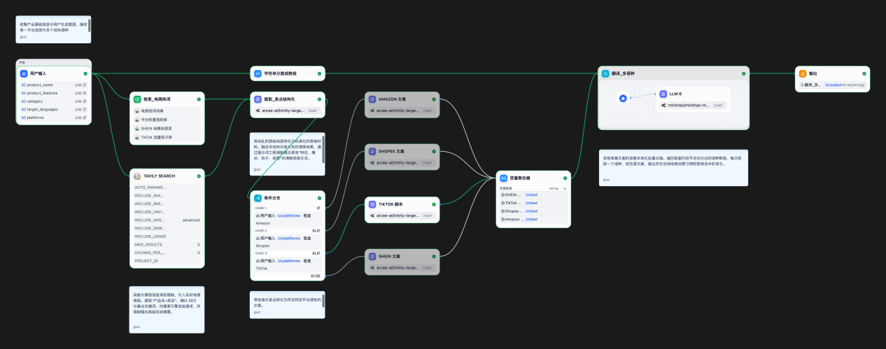

# Dify 工作流

[`多平台跨境电商文案及图片生成.yml`](多平台跨境电商文案及图片生成.yml) 是可直接导入 [Dify](https://dify.ai) 的工作流 DSL（`version: 0.6.0`）。

## 导入方式

1. Dify 控制台 → 工作室 → 导入 DSL 文件 → 选择该 `.yml`
2. 补齐依赖插件：`langgenius/deepseek`、`langgenius/tavily`
3. 配置密钥：DeepSeek API Key、Tavily API Key
4. 重建节点 `检索_电商热词` 引用的 4 个知识库（见下），或临时关闭该节点

## 工作流结构



完整节点讲解见 [`../docs/workflow-design.md`](../docs/workflow-design.md)；各节点 Prompt 原文见 [`prompts/`](prompts/)。

```
用户输入 ─┬─→ 检索_电商热词 (RAG) ──┐
          ├─→ Tavily Search (实时SEO) ┤→ 提取_卖点结构化 ─→ 条件分支 ─┬→ Amazon 文案 ─┐
          └─→ 字符串分割成数组 ─────────────────────────────────────┤→ Shopee 文案 ─┤
                                        │                          ├→ TikTok 脚本 ─┼→ 变量聚合器 ─→ 翻译_多语种(迭代) ─→ 输出
                                        │                          └→ SHEIN 文案 ──┘
                                        └─→ 生成_图片Prompt ─→ HTTP 请求(文生图) ────────────────────────────────────────→ 输出
```

## 依赖的知识库（4 个）

| 知识库 | 内容 |
|---|---|
| 电商关键词库 | 通用关键词列表、加权转化优先级、术语表、类别-关键词映射 |
| 平台规则参考库 | 各平台格式规范、语气要求、禁止内容、类别内容优先级 |
| 抖音挂钩库 | 按类型和产品类别组织的挂钩模板 |
| SHEIN 场景标签库 | 生活方式场景与风格描述符 |

> 知识库原始语料不含在本仓库中。`dataset_ids` 为占位，导入后需替换为你自己的知识库 ID。
>
> 4 个知识库目前是静态上传，自动化更新的知识库流水线（Knowledge Pipeline）设计见 [`../docs/workflow-design.md`](../docs/workflow-design.md#8-知识库流水线设计自动化更新方案)。

## 模型与成本

生成模型统一使用 **DeepSeek API**（`deepseek-chat`），相比原型阶段验证用的 OpenRouter 免费模型，具备更稳定的输出质量和更低的调用成本，适合面向真实商家规模化使用。导入时若插件版本与 DSL 记录的 `langgenius/deepseek:0.0.24` 不一致，Dify 会提示从插件市场安装匹配版本。模型选型权衡见 [`../docs/PRD.md`](../docs/PRD.md#83-技术架构概述产品化方向)。
